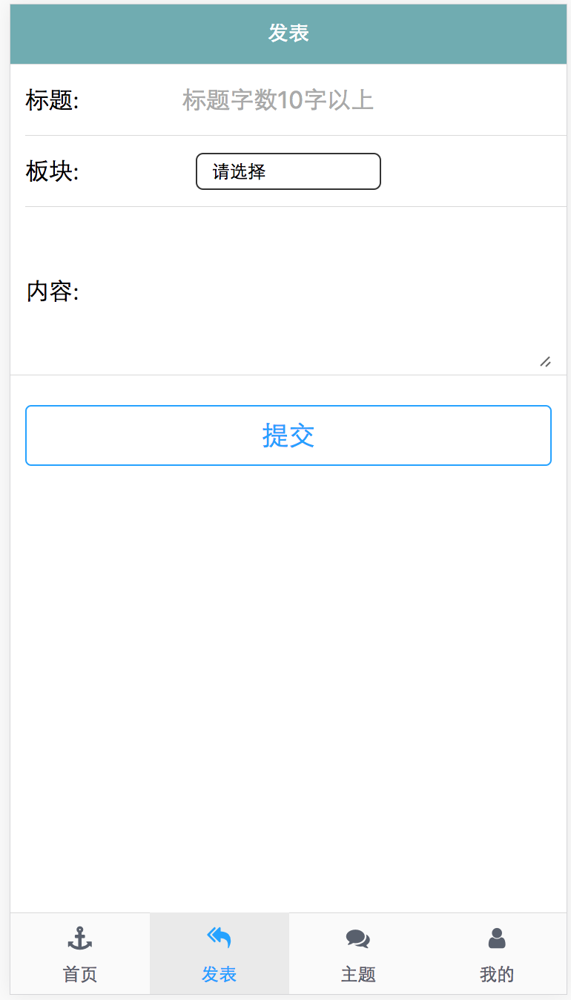
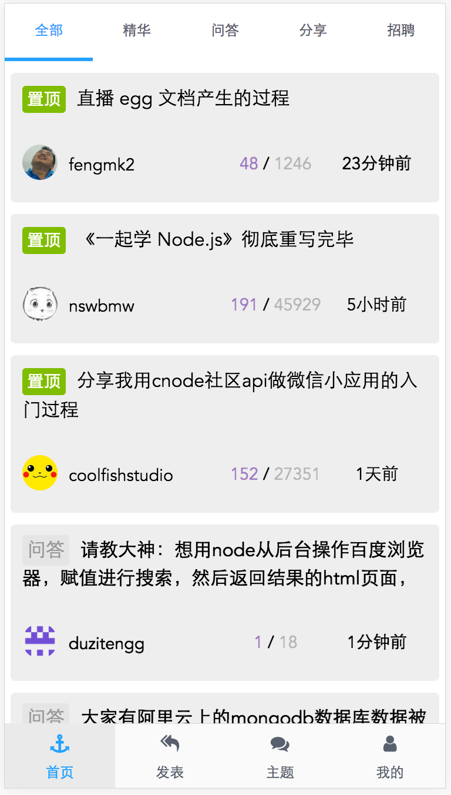
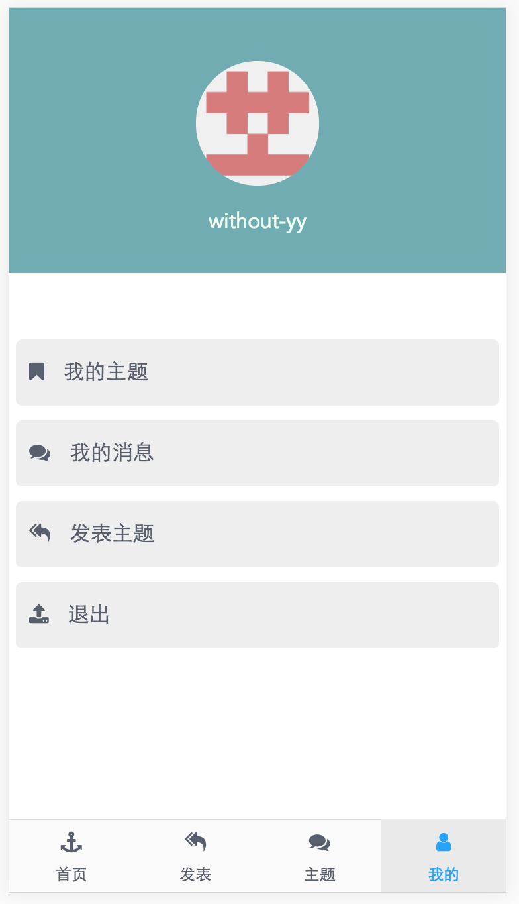

# cnode

> moblie-cnode

#预览
<a href="http://cnode.lxxlyy.com/">cnode.lxxlyy.com:8080</a>


## Build Setup

``` bash
# install dependencies
npm install

# serve with hot reload at localhost:8080
npm run dev

# build for production with minification
npm run build
```








For detailed explanation on how things work, consult the [docs for vue-loader](http://vuejs.github.io/vue-loader).
